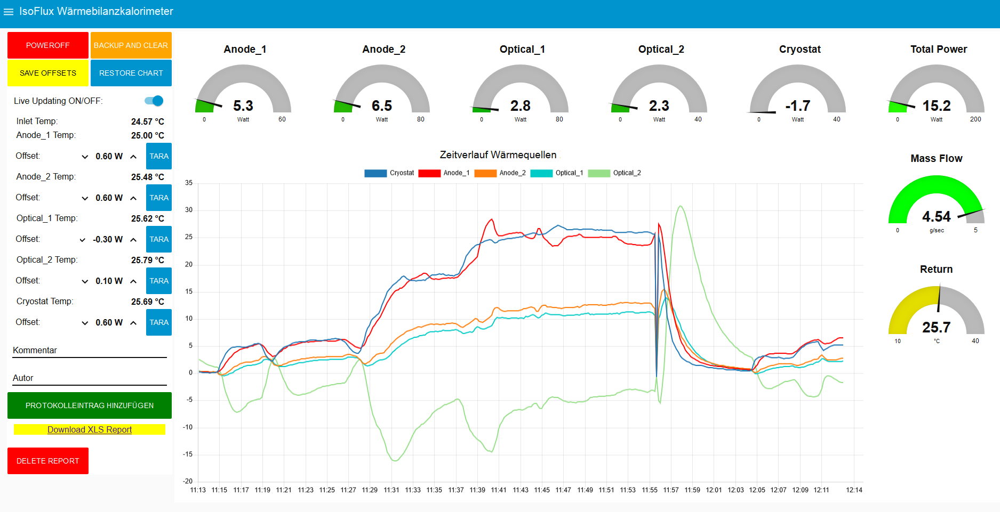

# IsoFlux

     """IsoFlux - Quasi-Isothermal Heat Balance Calorimetry

    Thermal power measurement for engineering application performing
    heat flux balance of device under test with constant flow rate coolant
    fluid.
    
    Quasi-isothermal condition is achieved by implementing a millikelvin-
    precision differential temperature measurement with platinum resistive
    temperature sensors in a deflection-type bridge configuration.
    
    By performing the measurement with heat exchanger and coolant
    temperature set approximately at environmental level, convection and
    radiation heat loss is negligible for power electronics application.
    
    Hardware: 2x ADS1256 24-Bit 8-ch low-noise ADC interfaced to the
              Raspberry Pi via SPI. Analog frontend currently using the
              Waveshare "High-Precision AD/DA Board".
         
    Coolant fluid circuit must be series-connected such that the hot
    outlet of each heat source is fed into the cold inlet of the next
    following heat source with negligible heat loss. 
    The order of the measurement channels can be configured in config file.
    
    Ulrich Lukas 2017-09-03
    """
